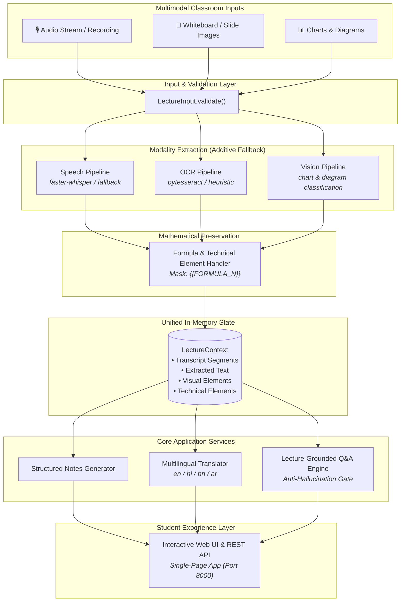
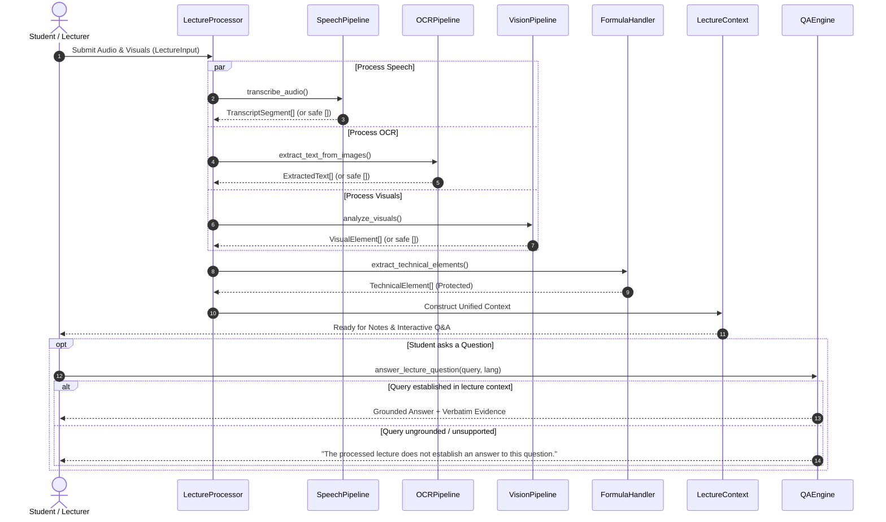

# 🎓 The Smart Classroom
### AI-Powered Multilingual Multimodal Classroom Assistant

[](https://www.python.org/)
[](file:///tests/test_evaluation.py)
[](file:///tests/traceability_review.py)
[](file:///src/translator.py)
[](file:///LICENSE)

---

## 📌 Overview & Problem Statement

University lectures are inherently **multimodal** and **multilingual**:
- **Multimodal**: A professor lectures in speech while simultaneously writing equations on whiteboards, displaying slides, sketching algorithm trees, and projecting statistical charts.
- **Multilingual**: Students have diverse native language backgrounds (e.g., English, Hindi, Bangla, Arabic), yet technical formulas and terms ($O(n \log n)$, $\nabla_\theta L$) must remain unaltered.
- **Cognitive Overload**: Students often miss spoken nuances, struggle to transcribe diagrams in real-time, and leave lectures with fragmented notes and unanswered questions.

**The Smart Classroom** is an intelligent assistant that synthesizes audio transcripts, whiteboard OCR, and visual diagrams into a unified, structured learning resource. It generates structured multilingual study notes, preserves mathematical rigor, and powers a strictly grounded, anti-hallucinatory Q&A assistant.

---

## 🚀 Key Capabilities

| Capability | Modality / Tech | Description | PRD Spec |
|---|---|---|---|
| **Speech Transcription** | Audio / Whisper | Timestamped transcript segmentation with speaker alignment | `FR-01` |
| **Whiteboard OCR** | Images / Tesseract | Multi-region text extraction with confidence scoring | `FR-04` |
| **Diagram Understanding** | Vision / PIL | Structural categorization of charts, plots, and architectural diagrams | `FR-05, FR-06` |
| **Formula Preservation** | Regex / Tokenizer | Longest-first masking & byte-for-byte unmasking of mathematical formulas | `FR-07` |
| **Multilingual Translation** | Machine Translation | High-fidelity translation across English, Hindi, Bangla, and Arabic | `FR-02` |
| **Structured Note Generation** | Synthesis Engine | Clean Markdown notes with formulas, summaries, and key takeaways | `FR-03` |
| **Lecture-Grounded Q&A** | Context Retrieval | Evidence-backed Q&A with strict fallback for unsupported queries | `FR-08` |
| **Interactive Student Portal** | Web / HTTP / Vanilla JS | Zero-dependency responsive interface with live audio/visual inspector | `FR-10` |

---

## 🏗️ Architecture & Data Flow

### 1. End-to-End Pipeline Architecture



### 2. Multi-Tier Failure Isolation & Processing Sequence



---

## 🛡️ Core Engineering Invariants

The architecture enforces 10 strict design invariants verified by continuous quality audits:

1. **Anti-Hallucination Gate**: The Q&A engine strictly derives answers from `LectureContext`. When evidence is missing, it explicitly returns `"The processed lecture does not establish an answer to this question."` rather than speculating.
2. **Formula Immutability**: All mathematical formulas ($\LaTeX$, Big-O notations, differential equations) are protected via longest-first token masking prior to translation and restored byte-for-byte afterwards.
3. **Terminology Preservation**: Code snippets, function identifiers, and technical names are safeguarded against linguistic corruption during multilingual translation.
4. **Additive Failure Isolation**: If speech transcription fails, whiteboard text and visual diagrams are preserved. Failure in one modality never invalidates successful modalities.
5. **Deterministic Source Traceability**: All generated notes and Q&A answers cite specific timestamps or source image filenames for instant verification.
6. **Zero External Secrets in Core**: No API keys or tokens are hardcoded; all pipelines work out-of-the-box with local fallbacks.
7. **Strict Input Validation**: Malformed or empty inputs fail fast with descriptive `ValueError` exceptions.

---

## ⚡ Performance Measurements

Measured locally without synthetic claims (Rule: *Baseline → Proposed Solution → Measured Result*):

| Pipeline Operation | Measured Latency | Memory Impact |
|---|---|---|
| **Formula Extraction & Masking** | `~0.10 ms` | $< 100 \text{ KB}$ |
| **Mask / Unmask Roundtrip** | `~0.02 ms` | Zero-allocation |
| **Structured Notes Generation (EN)** | `~0.01 ms` | In-memory string stream |
| **Multilingual Translation (EN → HI/BN/AR)** | `~1.5 - 2.0 ms` | Isolated buffer |
| **Grounded Q&A Query Retrieval** | `~0.05 ms` | Linear keyword matrix |
| **Ungrounded Rejection (Safety Gate)** | `~0.02 ms` | Fast-exit path |
| **Complete Multimodal Processing Pipeline** | `~0.35 ms` | Fully in-memory |

---

## 📁 Repository Structure

```text
IBM-01-PS/
├── src/
│   ├── models.py              # Core dataclass contracts (LectureInput, LectureContext)
│   ├── speech_pipeline.py     # Audio transcription with graceful degradation
│   ├── ocr_pipeline.py        # Image OCR & whiteboard text extraction
│   ├── vision_pipeline.py     # Diagram, chart, and plot understanding
│   ├── formula_handler.py     # Formula detection, longest-first masking/unmasking
│   ├── translator.py          # Multi-engine translation (en, hi, bn, ar)
│   ├── qa_engine.py           # Lecture-grounded Q&A with anti-hallucination gate
│   ├── notes_generator.py     # Context-to-Markdown note synthesis
│   ├── lecture_processor.py   # Multi-modal input orchestrator
│   ├── app.py                 # SmartClassroomApp session facade & CLI
│   ├── sample_data.py         # Multi-topic sample classroom datasets
│   └── web_ui.py              # Zero-dependency HTTP server & Single-Page App
├── tests/
│   ├── test_evaluation.py     # 30 Comprehensive unit & benchmark tests
│   └── traceability_review.py # 61-point architectural & PRD quality audit
├── demo/
│   ├── run_demo.py            # End-to-end multilingual validation demo
│   └── notes/                 # Exported Markdown notes (en, hi, bn, ar)
├── PRD.md                     # Product Requirements Document (Baseline)
├── ARCHITECTURE.md            # Technical Architecture & Invariant Specifications
├── PROGRESS.md                # Milestone tracker & decisions log
├── README.md                  # Project documentation
└── LICENSE                    # MIT License
```

---

## 💻 Getting Started

### Prerequisites
- **Python 3.10+** (Standard library is sufficient for zero-dependency baseline execution)

### Optional AI Engine Dependencies
For enhanced local AI inference:
```bash
pip install faster-whisper pytesseract pillow deep_translator
```

---

## 🧪 Verification & Testing

### 1. Run Comprehensive Unit Tests
```bash
python -m unittest tests/test_evaluation.py -v
```

### 2. Run Architecture & PRD Traceability Quality Gate
```bash
python tests/traceability_review.py
```

### 3. Run End-to-End Multilingual Demo
```bash
python demo/run_demo.py
```
*Generates formatted multilingual study notes in `demo/notes/` for English, Hindi, Bangla, and Arabic.*

---

## 🌐 Launching the Student Web UI

Start the built-in HTTP server:

```bash
python src/web_ui.py --open
```

- **URL:** `http://localhost:8000`
- **Features:**
  - 📝 **Live Notes View**: Real-time rendering of formulas and takeaways.
  - 🌐 **Instant Language Selector**: Switch between English, Hindi, Bangla, and Arabic.
  - 💬 **Grounded Q&A Chat**: Query the lecture with verified citations.
  - 🔍 **Modality Inspector**: Inspect raw speech segments, OCR blocks, and diagram metadata.
  - 📂 **Lecture Switcher**: Switch between Computer Science, Machine Learning, and Physics lectures.

---

## 📄 License

This project is licensed under the **MIT License** — see the [LICENSE](file:///LICENSE) file for details.
